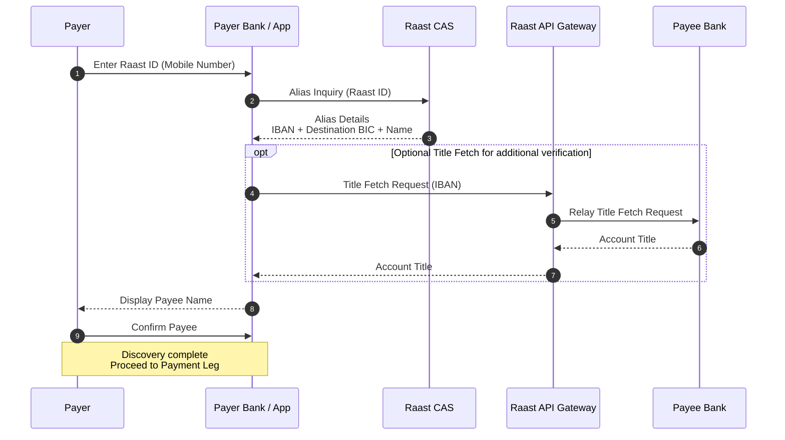
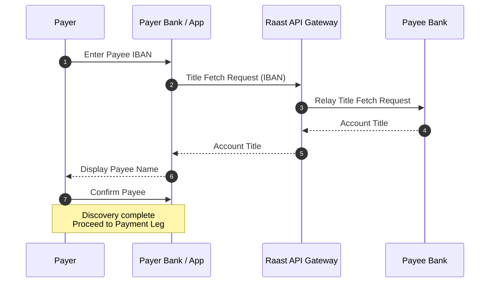
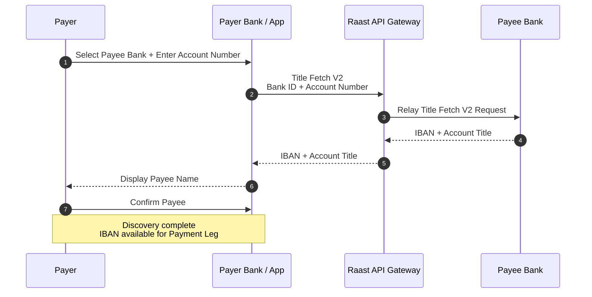
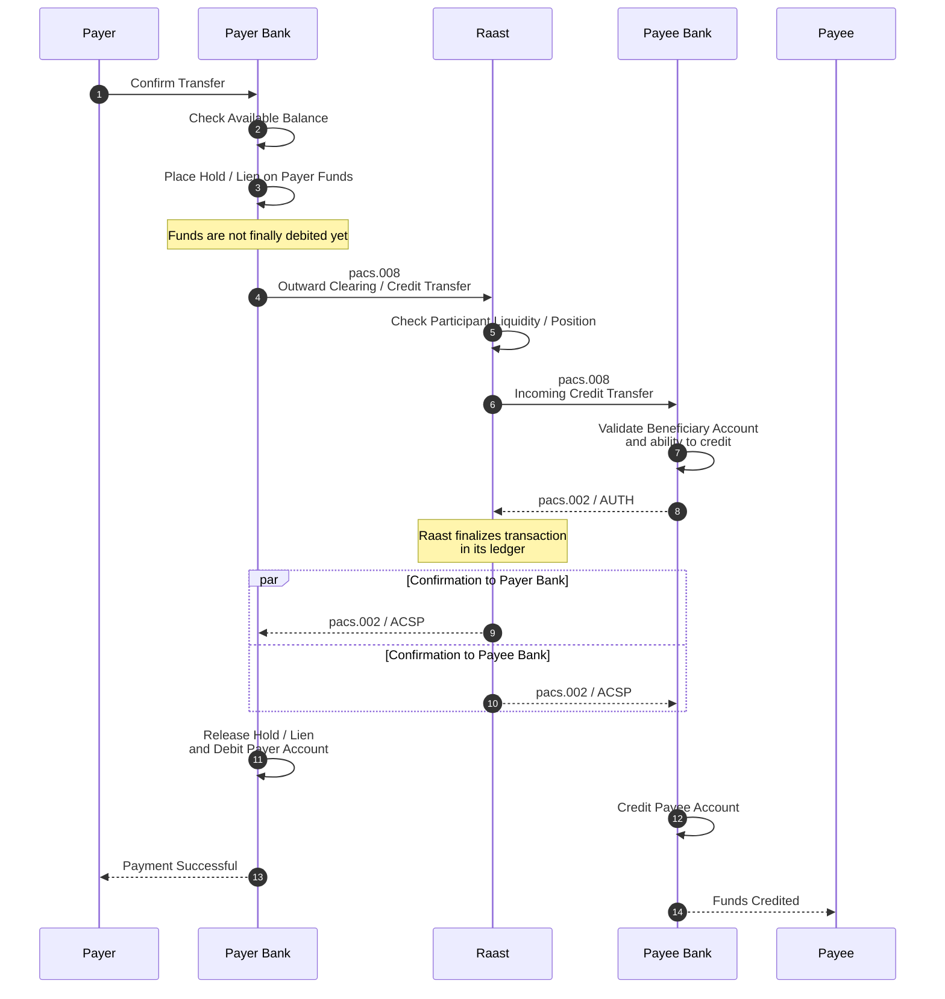
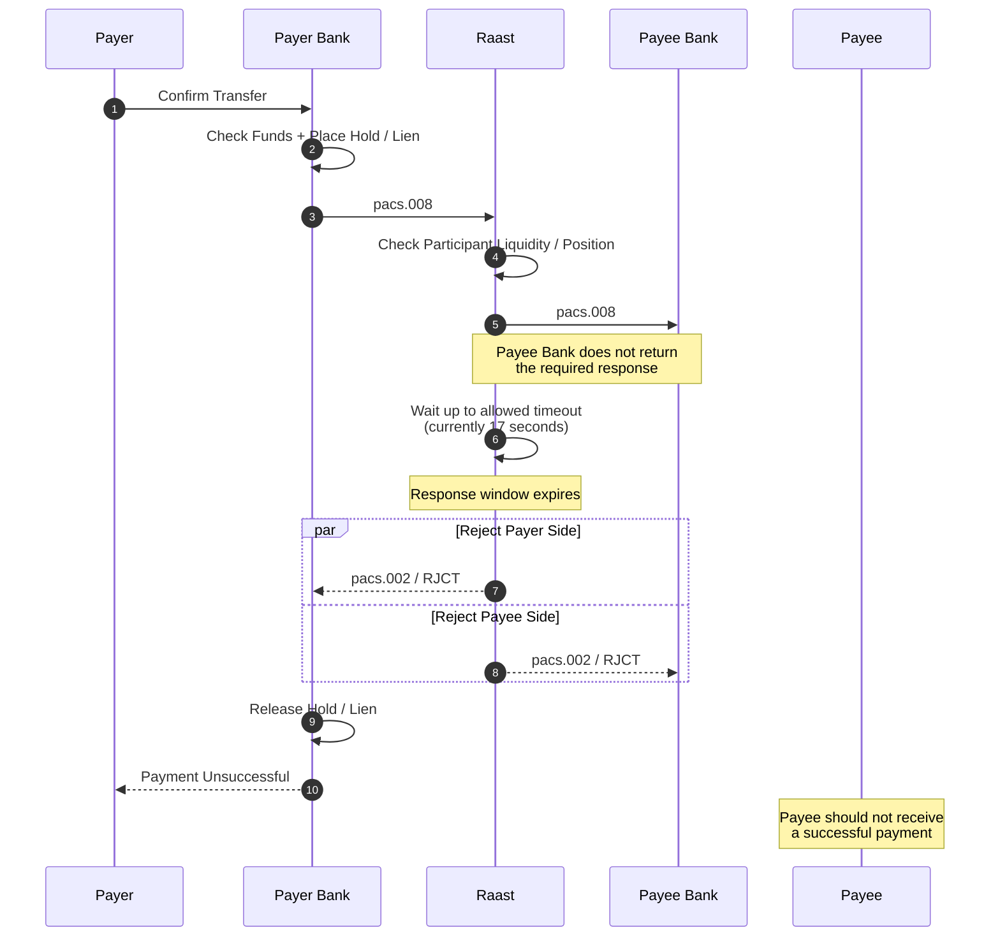
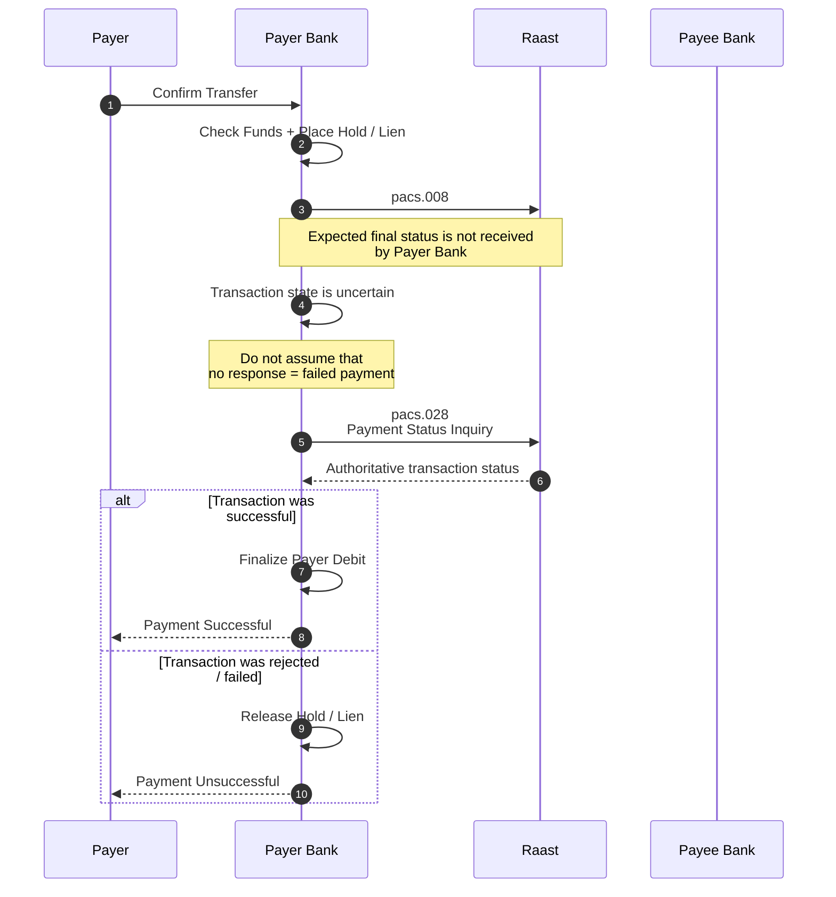
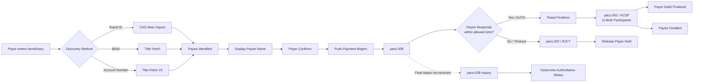

# Module 1 — Raast P2P Payment: An Overview

## Learning objectives

By the end of this module, a new technical employee should be able to:

- Explain a Raast P2P payment from the payer's perspective and from the system perspective.
- Explain why Raast ID exists and the role of the Centralized Alias Service (CAS).
- Distinguish discovery using Raast ID, IBAN, and legacy account number.
- Explain why beneficiary/title verification occurs before payment initiation.
- Describe the normal P2P payment flow using `pacs.008`, `pacs.002/AUTH`, and `pacs.002/ACSP`.
- Explain why P2P is a **push payment**.
- Recognize timeout and uncertain-state scenarios.
- Explain the role of `pacs.002/RJCT` and `pacs.028` in exception handling.

---

## 1. Start with the customer experience

Most employees joining a bank, fintech, payment company, DevOps team, or Application Reliability Engineering team have already used Raast without necessarily knowing what happens underneath the mobile application.

A typical P2P journey starts when a **payer** wants to send money to a **payee**. A bank or wallet application commonly allows the payer to identify the beneficiary using one of three methods:

1. **Raast ID** — currently commonly the customer's registered mobile number.
2. **IBAN** — the beneficiary's International Bank Account Number.
3. **Account Number** — a legacy/local account number together with the destination institution.

Before money is sent, Raast supports a **discovery/verification leg**. Its purpose is to help the payer identify and confirm the intended payee.

A useful mental model is:

> **Discovery answers: “Who am I paying?”**  
> **Payment answers: “Can this money be transferred and finalized?”**

---

# Part A — Discovery and Beneficiary Verification

## 2. Why Raast ID exists

Bank account numbers and IBANs are not particularly easy for people to remember or communicate. Raast therefore supports an **alias** that can be associated with a customer's bank account.

Raast maintains a **Centralized Alias Service (CAS)**. Conceptually, CAS is a centralized directory that holds alias registrations and the information needed to resolve an alias to the customer's destination account/institution.

The alias capability can support multiple alias types. In the current operating model covered by this training, the practical relationship is **one customer / one account / one alias**, and the commonly used Raast ID is the customer's mobile number.

A customer registers a Raast ID through their participating bank or institution and links it to the bank account of their choice. The participant registers the association with CAS. Thereafter, another participant can perform an **Alias Inquiry** using the Raast ID and obtain the information required to identify and route toward the destination account, including the IBAN, destination BIC and beneficiary information.

This is what makes it possible for a payer to type a familiar mobile number rather than a long IBAN.

---

## 3. Discovery using Raast ID / Alias

The payer enters the payee's Raast ID. The payer institution performs an Alias Inquiry against CAS. The result provides the destination information and beneficiary name. A Title Fetch may additionally be performed for verification.

### Engineering takeaway

A **Raast ID is an alias, not the actual destination account number**. CAS resolves the easy-to-remember alias into information that can be used for beneficiary identification and subsequent payment routing.

---

## 4. Discovery using IBAN

When the payer already has the beneficiary's IBAN, there is no alias to resolve through CAS. The payer institution can use Raast's API Gateway to perform a **Title Fetch** from the destination institution.

### Engineering takeaway

CAS is not needed for this journey because there is no alias to resolve. The Title Fetch allows the payer to see the beneficiary name before authorizing the transfer.

---

## 5. Discovery using legacy Account Number

A payer may also identify a beneficiary using a bank/institution plus a legacy account number rather than an IBAN. Raast provides another Title Fetch variant, referred to in this training as **Title Fetch V2**.

The request contains the destination bank/institution identifier and account number. The response can provide both the **IBAN** and **account title**.

---

## 6. The three discovery methods at a glance

| Payer knows | Primary discovery mechanism | Main result |
|---|---|---|
| Raast ID / mobile alias | CAS Alias Inquiry | IBAN, destination BIC and beneficiary information; optional Title Fetch |
| IBAN | Title Fetch | Account title |
| Bank + Account Number | Title Fetch V2 | IBAN + account title |

Regardless of the discovery method, the objective is to show the payer who will receive the funds **before the payer confirms the payment**.

---

# Part B — The Payment Leg

## 7. P2P is a push payment

Raast P2P is a **push payment**. The payer initiates and authorizes the transfer of funds toward the payee.

This distinction is important. The payment does not begin merely because the payee exists. The payer selects the beneficiary, sees the beneficiary information returned during discovery, confirms the intended payee and then instructs their institution to send the money.

---

## 8. ISO 20022 and Raast messages

Raast uses **ISO 20022** messaging for its instant payment flows. ISO 20022 is a structured financial messaging standard used to exchange payment and related financial information between systems and institutions.

For engineers who have previously worked with card payments, a useful comparison is that card ecosystems have historically made extensive use of **ISO 8583**, whereas modern account-to-account payment infrastructures commonly use ISO 20022 messages.

In the basic successful P2P flow introduced in this module, the important messages are:

- **`pacs.008`** — the credit transfer / clearing message carrying the payment instruction.
- **`pacs.002/AUTH`** — the payee participant's response to Raast indicating that it can accept/authorize the incoming payment in the flow described here.
- **`pacs.002/ACSP`** — the successful status sent **by Raast to both participants** after Raast finalizes the transaction in its ledger.
- **`pacs.002/RJCT`** — a rejected payment status.
- **`pacs.028`** — an inquiry/status investigation mechanism used when the sending participant does not know the final outcome of a payment.

---

## 9. Normal successful P2P payment flow

After beneficiary discovery and payer confirmation, the payment leg begins.

The payer institution first verifies that the payer has sufficient funds. It places a hold/lien on the funds rather than immediately treating the transaction as finally completed. It then sends the payment to Raast using `pacs.008`.

Raast checks the sending participant's available liquidity/position in the Raast ledger. If sufficient liquidity is available, the payment is forwarded to the payee institution.

The payee institution validates the beneficiary account and its ability to credit the transaction. It responds to Raast with `pacs.002/AUTH`.

Once the transaction is finalized in the Raast ledger, **Raast sends `pacs.002/ACSP` to both the payer and payee participants**. The payer institution can then finalize the customer's debit/release the hold as applicable, while the payee institution credits the beneficiary.

---

# Part C — Exceptions and Uncertain Outcomes

## 10. Think like an Application Reliability Engineer

A payment diagram showing only the happy path is not enough for someone responsible for production reliability.

At each network hop, engineers should ask:

- What happens if the destination system is unavailable?
- What happens if a request reaches the destination but the response does not return?
- What happens if processing exceeds the allowed time?
- What happens if one participant thinks the transaction failed while another has processed it?
- When is it safe to release a customer's held funds?
- How does the sender determine the authoritative final status?

The distinction between a **known failure** and an **unknown outcome** is fundamental to payment operations.

---

## 11. Exception scenario — Payee participant timeout

Consider a payment where Raast successfully sends the `pacs.008` to the payee institution, but the payee institution does not provide the required response within the permitted response window.

For the operating flow covered by this training, the response timeout is **17 seconds**.

Raast cannot wait indefinitely for the receiving participant. If the required response is not received within the allowed time, Raast rejects the transaction and communicates the rejection using `pacs.002/RJCT`.

### Reliability lesson

A timeout is not simply “the application was slow.” In an instant-payment system, response deadlines are part of the transaction protocol and can determine whether a transaction succeeds or is rejected.

---

## 12. Exception scenario — Payer participant receives no final status

A more subtle situation occurs when the payer institution sends a payment but receives **neither an acceptance nor a rejection**.

This can happen because of a network interruption, dropped response, connection problem, middleware failure or another communication issue. The absence of a response does **not automatically prove that the payment failed**.

For example, Raast may have processed the transaction and sent a final status, but the response may not have reached the payer institution.

The sending institution therefore needs a way to determine the authoritative state before deciding what to do with the payer's held funds. Raast provides the **`pacs.028` inquiry mechanism** for this purpose.

> **Important:** This diagram intentionally introduces `pacs.028` at a conceptual level. Detailed `pacs.028` response handling, retry rules, timing, message correlation and additional exception cases should be covered in the subsequent operations/reliability module.

---

## 13. Why the hold/lien matters

The payer institution must manage the customer's balance carefully while the distributed payment is being processed.

If it immediately releases funds simply because it did not receive a response, it risks allowing the customer to spend money that may already have been successfully transferred through Raast.

Conversely, if the transaction is definitively rejected, the customer should not remain deprived of those funds unnecessarily.

This is why engineers must distinguish between:

- **Success** — an authoritative successful status is known.
- **Failure / Rejection** — an authoritative rejected status is known.
- **Unknown / Uncertain** — the participant does not yet know the authoritative final outcome.

The third state is particularly important for Application Reliability, Operations and Support engineers.

---

# 14. End-to-end mental model

---

# 15. Key terms

| Term | Meaning in this module |
|---|---|
| Payer | Person sending money |
| Payee | Person receiving money |
| Participant | Bank or institution connected to Raast |
| Raast ID | Easy-to-remember alias linked to an account; commonly a mobile number |
| CAS | Centralized Alias Service used to register and resolve aliases |
| BIC | Bank/Business Identifier Code used to identify the destination institution |
| Title Fetch | API-based beneficiary account-title verification |
| Title Fetch V2 | Variant supporting bank/institution + legacy account number and returning IBAN/title |
| Push Payment | Payment initiated by the payer to send funds to the payee |
| ISO 20022 | Structured financial messaging standard used by Raast |
| `pacs.008` | Credit transfer / clearing instruction |
| `pacs.002/AUTH` | Payee participant authorization/acceptance response in this flow |
| `pacs.002/ACSP` | Successful processing status sent by Raast to both participants after finalization |
| `pacs.002/RJCT` | Rejected payment status |
| `pacs.028` | Payment status inquiry mechanism used to resolve an uncertain transaction state |
| Hold / Lien | Reservation of payer funds while payment outcome is being determined |
| Liquidity / Position | Funds available to a participant within the Raast settlement/ledger mechanism |

---

# 16. What a new technical employee should remember

1. **Discovery happens before payment.**
2. **Raast ID is an alias** designed to make beneficiary identification easier for customers.
3. **CAS resolves aliases**; Title Fetch verifies beneficiary information through participating institutions.
4. **IBAN and Account Number discovery do not require the same path as alias discovery.**
5. Raast P2P is a **push payment** initiated by the payer.
6. The payer bank normally reserves/holds funds before sending the payment instruction.
7. **`pacs.008` carries the payment instruction.**
8. The payee participant responds to Raast with **`pacs.002/AUTH`** in the successful flow described here.
9. After finalization, **Raast sends `pacs.002/ACSP` to both participants**.
10. If the payee participant does not respond within the permitted window (currently **17 seconds** for the flow covered here), Raast rejects the transaction using **`pacs.002/RJCT`**.
11. **No response is not the same as rejection.** If the payer institution does not know the final status, it must resolve the uncertainty rather than blindly releasing funds.
12. **`pacs.028` provides a status inquiry mechanism** for uncertain payment outcomes.

---

## Reflection before taking the quiz

Before continuing, think about the payment as a distributed system. Identify at least five points where a failure could occur and ask yourself whether each failure would create a **known rejection** or an **unknown transaction state**.

That distinction will become increasingly important in the next modules on exception handling, operations, observability and troubleshooting.
